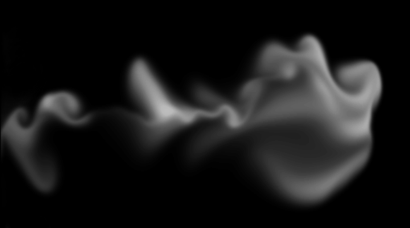

# FluidSolver2D
2D fluid simulator in c++ using OpenCL based on the paper "Real-Time Fluid Dynamics for Games" by Jos Stam

# Dependencies

This project requires the SFML 2.0 and OpenCL 1.2.
The main configuration variables are located in config.h where you can change the screen resolution, the OpenCL device you want to use and the fluid properties.

# Usage

* ESC - exit the program
* Left mouse button - add density under the cursor within a certain radius
* Right mouse drag - add velocity to the velocity field in the direction of the mouse within a certain radius
* Mouse wheel - change the radius 
* Space - reset the simulation 

---

# 3D Solver

A 3D solver is available in the *fluid_solver_3d/* folder. The user interface is still in 2D but, you can record the state of the fluid in 3D in .df3. These file can be read by POV-Ray to render an animation of the fluid, see the example in *povray_scene/*.

# Usage

* Everything works like the 2D solver
* D Key - start or stop the record of the state of fluid